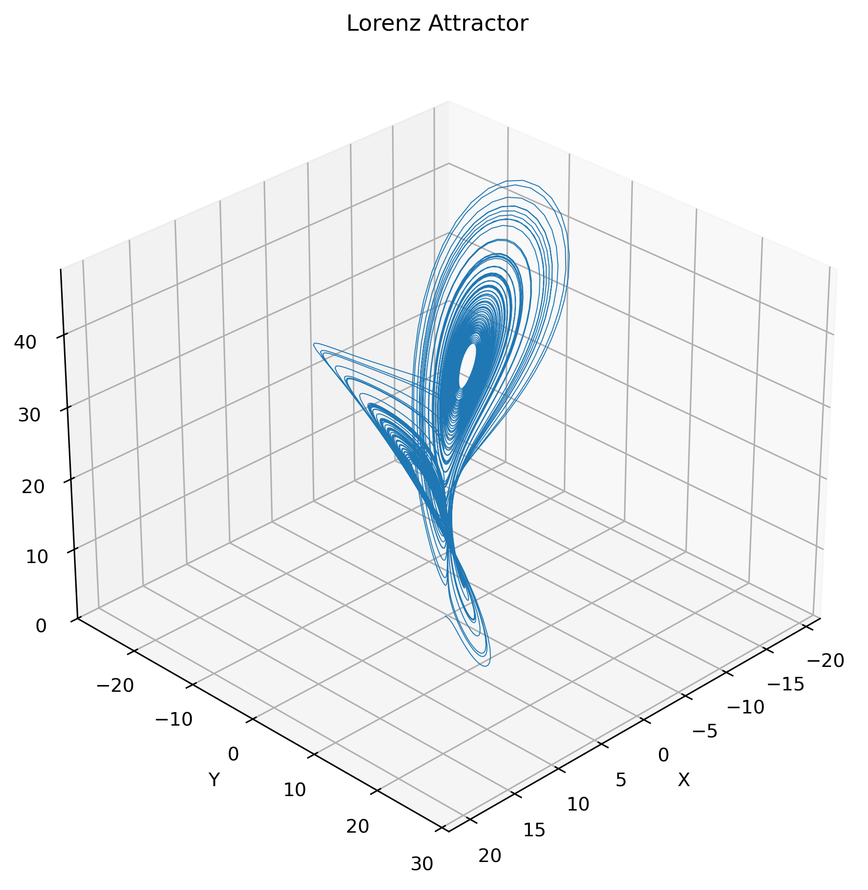
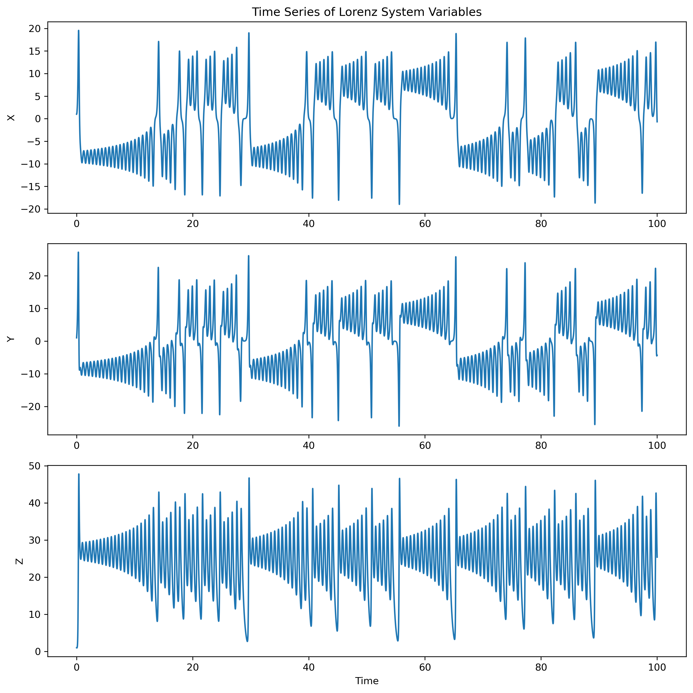

# Lorenz System

The Lorenz system is a set of three coupled, nonlinear differential equations introduced by Edward Lorenz in 1963 to model atmospheric convection. It is widely known for its chaotic solutions and is often used as an example of deterministic chaos in dynamical systems.

## The Differential Equations

The Lorenz equations are given by:

$$
\begin{aligned}
    \frac{dx}{dt} & = \sigma (y - x) \\
    \frac{dy}{dt} & = x(\rho - z) - y  \\
    \frac{dz}{dt} & = xy - \beta z
\end{aligned}
$$

Where:

- \(x, y, z\) are the system variables (e.g., representing convection, temperature, etc.).
- \(\sigma\) (sigma) is the Prandtl number, related to the fluid's viscosity.
- \(\rho\) (rho) is the Rayleigh number, related to the temperature difference driving convection.
- \(\beta\) (beta) is a geometric factor.

## Key Features

- **Chaotic Behavior**: The Lorenz system exhibits chaotic behavior for certain parameter values, meaning that small changes in initial conditions can lead to vastly different outcomes over time. This sensitivity is often referred to as the "butterfly effect."
- **Visualization**: The Lorenz attractor, a 3D trajectory of the system, is a famous visualization of chaos.

## Implementation

This repository includes:

1. A Python implementation of the Lorenz system using `scipy.integrate.odeint` to solve the differential equations.
2. Visualization of the Lorenz attractor in both static (Matplotlib) and interactive (Plotly) formats.
3. Time series plots of the system variables \(x\), \(y\), and \(z\).

## Usage

1. Install the required Python libraries:

   ```bash
   pip install numpy scipy matplotlib plotly pandas
   ```

   or

   ```bash
   conda install numpy scipy matplotlib plotly pandas -c conda-forge
   ```

2. Run the Python script [`Lorenz.py`](Lorenz.py) to generate the Lorenz attractor and time series plots.

3. The generated data can be exported to a CSV file [Data.csv](Data.csv) for further analysis.

## Example Output

### Lorenz Attractor (3D Visualization)



### Time Series of Variables



## References

- Edward N. Lorenz, "Deterministic Nonperiodic Flow," *Journal of the Atmospheric Sciences*, 1963.
- [Wikipedia: Lorenz System](https://en.wikipedia.org/wiki/Lorenz_system)
